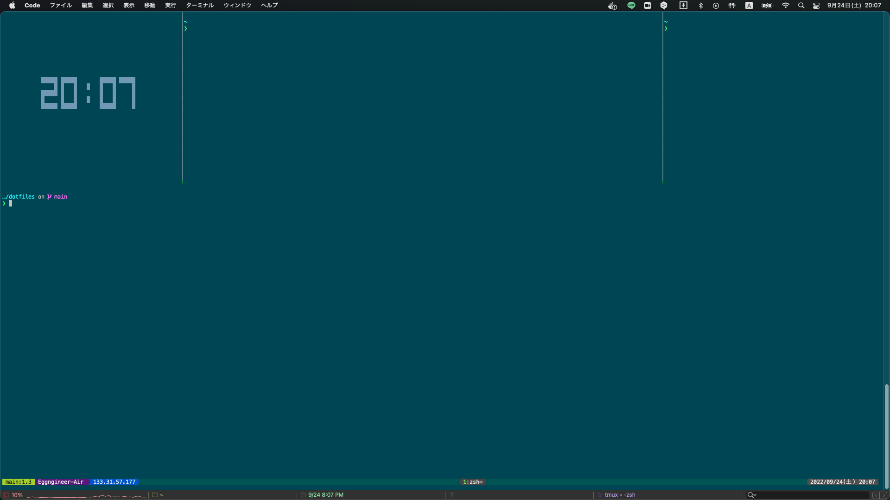

# Eggngineer's dotfiles

## .tmux.conf
* `smooth-scrolling`と`mouse-operation`を有効
* Prefixのキーバインドを `C-b` から `C-q` に変更
* コピーモード（`C-q+[`）の操作はVimライクに設定
  * `hjkl`: 左下上右
  * `v`: 選択開始（`VISUAL`モード）
  * `V`: 行選択
  * `y`: 選択領域のヤンク
  * `y`: 行ヤンク
  * `C-p`: クリップ済みのテキストをペースト
## .zshrc
* source .zsh/*
##  .zsh
<pre>
.zsh
├── aliases.zsh
├── autoload.zsh
├── completions.zsh
├── functions.zsh
├── history.zsh
├── keybind.zsh
├── path_export.zsh
├── setopt.zsh
├── zle.zsh
└── zplug_plugin.zsh
</pre>
## Topics
### SpotLight
`C-Space`にMacOSのSpotlight検索のような体験の機能をバインドしています．

結構ad-hocに作っていて，`/Applications/`,`/System/Applications/`,`/System/Applications/Utilities/`に入っている全てのアプリケーションを曖昧検索して起動できます．改善案やPRお待ちしてます．

###　Misc

あとは特に面白い実装はないですが，気分でちょいちょい機能追加していきます．
